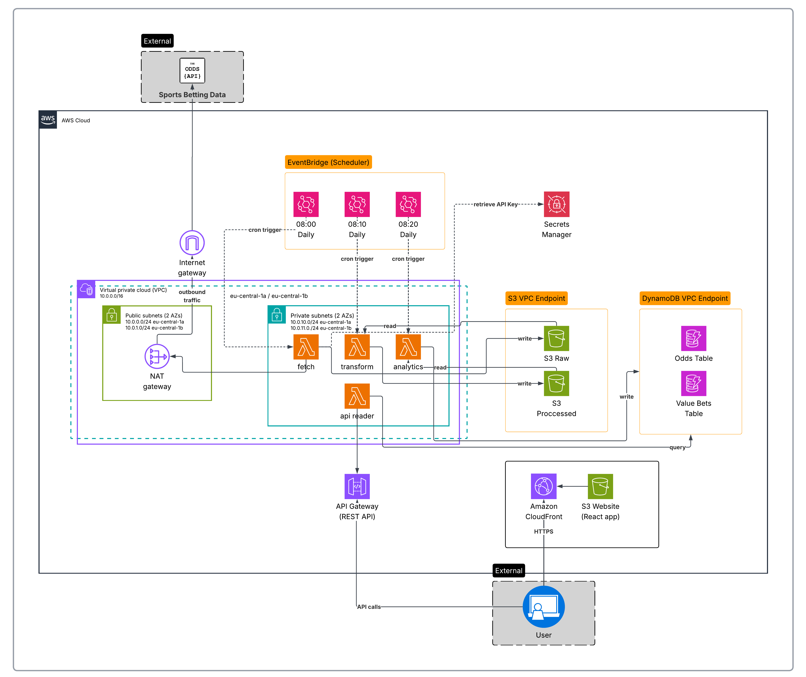

# Bundesliga Analytics

> **Serverless Value Betting Platform on AWS**  
> Automated ETL pipeline that analyzes sports betting odds across 20+ bookmakers to identify value betting opportunities in the German Bundesliga.

[](https://aws.amazon.com)
[](https://www.terraform.io)
[](https://www.python.org)
[](https://reactjs.org)

---

## 📊 Project Overview

This project demonstrates a **production-grade, serverless data pipeline** built entirely on AWS. It automatically fetches betting odds daily, performs statistical analysis, and identifies high-conviction betting signals through a modern React dashboard.

**Key Highlights:**
- 🤖 **Fully Automated**: Runs daily at 08:00 UTC via EventBridge
- 💰 **Cost Optimized**: Development environment costs **$1.40/month**
- 🏗️ **Infrastructure as Code**: 100% Terraform managed, reproducible in 20 minutes
- 🔒 **Production Ready**: VPC isolation, private subnets, NAT gateway, encrypted storage
- 📈 **Scalable**: Serverless architecture handles variable load automatically

---

## 🏗️ Architecture



### Production Architecture Components:

**Compute & Orchestration:**
- 4 Lambda Functions (Python 3.12) in private subnets across 2 AZs
- EventBridge (CloudWatch Events) for cron-based scheduling
- NAT Gateway for secure outbound internet access

**Storage & Database:**
- 3 S3 Buckets (raw data, processed data, static website)
- 2 DynamoDB Tables (odds history, value bets)
- VPC Endpoints for S3 and DynamoDB (cost optimization)

**API & Frontend:**
- API Gateway (REST API) for backend
- CloudFront CDN + S3 for React frontend
- Secrets Manager for API key storage

**Security:**
- Private subnets for Lambda execution
- Security groups for network isolation
- Encryption at rest (S3, DynamoDB)
- IAM least-privilege policies

---

## 🔄 ETL Pipeline

### Stage 1: Extract (08:00 UTC)
**Lambda: `fetch_odds`**
- Retrieves API key from Secrets Manager
- Calls The Odds API for Bundesliga matches
- Fetches odds from 20+ bookmakers
- Stores raw JSON in S3
- **Runtime:** ~15-20 seconds

### Stage 2: Transform (08:10 UTC)
**Lambda: `transform_data`**
- Reads latest raw data from S3
- Calculates average odds across all bookmakers
- Identifies best (highest) odds for each outcome
- Computes market efficiency using Coefficient of Variation
- Calculates value percentage: `(best_odds - avg_odds) / avg_odds × 100`
- Generates recommendations: STRONG BUY, BUY, CONSIDER, HOLD
- Stores processed data in S3
- **Runtime:** ~10-15 seconds

### Stage 3: Load (08:20 UTC)
**Lambda: `analytics`**
- Reads processed data from S3
- Filters for actionable signals (BUY/STRONG BUY only)
- Writes to DynamoDB tables with 90-day TTL
- **Runtime:** ~5-10 seconds

### Stage 4: API (On-Demand)
**Lambda: `api_reader`**
- Triggered by API Gateway requests
- Queries DynamoDB for value bets
- Returns JSON response to frontend
- **Cold start:** ~1-3 seconds (in VPC), **Warm:** ~100-200ms

---

## 📈 Value Calculation

### Statistical Analysis

The system uses **market efficiency theory** to identify value:

```
Value % = (Best Odds - Average Odds) / Average Odds × 100

Signals:
- Value > 8%  → STRONG BUY 🟢
- Value > 5%  → BUY 🟢
- Value > 3%  → CONSIDER 🟡
- Value < 3%  → HOLD ⚪
```

**Example:**
```
Match: Bayern Munich vs Borussia Dortmund (Home Win)
Average Odds: 1.85 (market consensus)
Best Odds: 1.95 (bet365)
Value: +5.4%
Signal: BUY ✅
```

---

## 💻 Technology Stack

### Infrastructure
- **Terraform** - Infrastructure as Code
- **AWS CLI** - Resource management

### Backend (AWS Services)
- **Lambda** (Python 3.12) - Serverless compute
- **DynamoDB** - NoSQL database
- **S3** - Object storage & static hosting
- **API Gateway** - REST API
- **EventBridge** - Event scheduling
- **Secrets Manager** - Secure credential storage
- **CloudWatch** - Logging & monitoring
- **VPC** - Network isolation

### Frontend
- **React 18** - UI framework
- **CloudFront** - Global CDN

---

## 🚀 Deployment

### Prerequisites
- AWS Account with appropriate permissions
- AWS CLI configured
- Terraform >= 1.5
- Node.js >= 18
- Python >= 3.12
- The Odds API key

### Quick Start

**1. Clone the repository:**
```bash
git clone https://github.com/erenk4036/bundesliga-analytics.git
cd bundesliga-analytics
```

**2. Configure Terraform variables:**
```bash
cd terraform
cp terraform.tfvars.example terraform.tfvars
# Edit terraform.tfvars and add your Odds API key
```

**3. Deploy infrastructure:**
```bash
# Development environment
terraform init
terraform workspace select default
terraform apply

# Production environment
terraform workspace new prod
terraform apply -var-file="environments/prod.tfvars"
```

**4. Deploy frontend:**
```bash
cd ../frontend
npm install
npm run build

cd ../terraform
aws s3 sync ../frontend/build/ s3://$(terraform output -raw website_bucket_name)/ --delete
aws cloudfront create-invalidation --distribution-id $(terraform output -raw cloudfront_distribution_id) --paths "/*"
```

**5. Access the dashboard:**
```bash
terraform output website_url
```

---

## 🌍 Environments

### Development (~$1.40/month)
- Lambda outside VPC (no NAT Gateway)
- Cost-optimized for development
- Direct internet access

### Production (~$48/month)
- Lambda in private subnets (2 AZs)
- NAT Gateway for controlled internet access
- VPC Endpoints for AWS services
- Enhanced security and monitoring

---

## 💰 Cost Breakdown

### Development Environment
```
Lambda Invocations:     $0.00 (Free Tier)
DynamoDB:               $0.00 (Free Tier)
S3 Storage:             $0.00 (Free Tier)
API Gateway:            $0.00 (Free Tier)
CloudFront:             ~$1.00
Secrets Manager:        $0.40
────────────────────────────────
TOTAL:                  ~$1.40/month
```

### Production Environment
```
All Dev costs:          $1.40
NAT Gateway:            $32.00
Enhanced monitoring:    ~$5.00
X-Ray tracing:          ~$2.00
Data transfer:          ~$8.00
────────────────────────────────
TOTAL:                  ~$48/month
```

---

## 🎓 What I Learned

### Technical Skills
- AWS Serverless Architecture (Lambda, DynamoDB, S3, API Gateway, CloudFront)
- Infrastructure as Code with Terraform
- VPC Networking (subnets, NAT Gateway, VPC Endpoints)
- Cost Optimization strategies
- React Development & API integration

### Key Insights
1. **Serverless != No Ops**: Monitoring and architecture matter
2. **Infrastructure Decisions Have Real Costs**: NAT Gateway alone = $32/month
3. **VPC Placement is Critical**: Lambda in VPC adds 1-3s cold start
4. **DynamoDB Schema Design**: Composite keys must be absolutely unique
5. **CloudWatch Logs Are Essential**: Debugging requires proper logging

### Challenges Overcome
- DynamoDB duplicate key errors (solved with unique offsets)
- Reserved keywords in DynamoDB queries
- Lambda Layer build for platform-specific dependencies
- S3 bucket versioning during cleanup
- Secrets Manager 30-day deletion recovery window

---

## 🚀 Future Enhancements

- Historical trend analysis (30/60/90 day)
- Email/SMS notifications for Strong Buy signals
- Multi-league support (Premier League, La Liga)
- Machine learning for win probability prediction
- Real-time odds tracking via WebSocket
- Mobile app (React Native)
- CI/CD pipeline with GitHub Actions

---

## 📁 Project Structure

```
bundesliga-analytics/
├── terraform/              # Infrastructure as Code
│   ├── main.tf
│   ├── vpc.tf
│   ├── lambda.tf
│   ├── dynamodb.tf
│   ├── s3.tf
│   └── ...
├── lambda/                 # Lambda function code
│   ├── fetch_odds/
│   ├── transform_data/
│   ├── analytics/
│   └── api_reader/
├── frontend/               # React application
│   ├── src/
│   ├── public/
│   └── package.json
├── docs/
│   └── architecture-diagram.png
└── README.md
```

---

## 🐛 Troubleshooting

### Website Shows 404
**Solution:** Deploy frontend to S3
```bash
cd frontend && npm run build
cd ../terraform
aws s3 sync ../frontend/build/ s3://$(terraform output -raw website_bucket_name)/ --delete
```

### Lambda Function Fails
**Check logs:**
```bash
aws logs tail /aws/lambda/bundesliga-analytics-fetch-odds-dev --follow
```

---

## 📄 License

This project is open source and available under the MIT License.

---

## 🙏 Acknowledgments

- **AWS Restart Program** - Cloud training
- **The Odds API** - Sports betting data
- **Terraform & AWS Documentation**
- **Claude (Anthropic) & Amazon Q** - AI pair programming


---

## 📧 Contact

**Eren Kolac**
- GitHub: [@erenk4036](https://github.com/erenk4036)
- Project: [bundesliga-analytics](https://github.com/erenk4036/bundesliga-analytics)
- LinkedIn: [Eren Kolac](https://linkedin.com/in/eren-kolac-a2406a174/)

**⭐ If you find this project useful, please consider giving it a star!**

Built with ❤️ as part of the AWS Restart Program | February 2026
